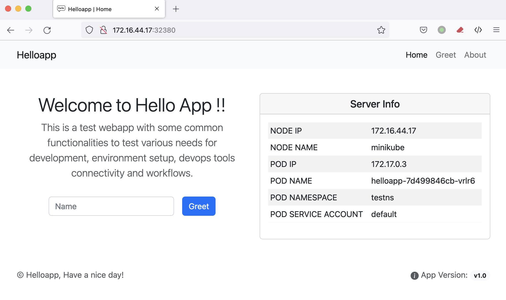

# Helloapppython

    

<hr>

### Introduction

This is a test api and webapp with some common functionalities to test various
needs for development, environment setup and devops tools connectivity
and workflows.



### Api's for the app

- Api to update the app version

  `http://localhost:5000/appver?val=<New-version>`

- Api to greet a user for the webapp

  `http://localhost:5000/greet/<name>`

  `http://localhost:5000/api/greet/<name>`

- Api for server info

  `http://localhost:5000/api/info`

### Functionalities

1. Update app version for the webapp ( by api)
2. Greet user with POST method ( via api and web)
3. Get server info, once deployed on Kubernetes (on homepage and via api in json format)
4. For running on Kubernetes, by using `kubectl kustomise` we can modify image (name & tag) and other configurable parans via updating kustomization.yaml in kubernetes folder.
5. This app can be built in 3 ways

   5.1 With gunicorn WSGI server - Dockerfile added.

   5.2 With python and Flask module only - Dockerfile added.

   5.3 With buildpack,

   - The build command can be overriden by Procfile in root folder.
   - Other params can be passed as command line options in build command.
   - The buildpack command to build OCI image for app using **pack** CLI locally using container runtime.

   ```
    $ pack build helloapp-img \
       --path ~/files/helloapppython \
       --env BP_CPYTHON_VERSION=3.9.13  \
       --buildpack paketo-buildpacks/python  \
       --builder paketobuildpacks/builder:full
   ```

   - The buildpack command to build OCI image for app using **kpack** [kp] CLI in kubernetes cluster configured with remote image registry.

     ```
     $ kp image create helloapppython \
        --tag registry.mylab.com/rsingh-lib/helloapppython \
        --cluster-builder default \
        --namespace helloapppython \
        --wait \
        --git https://github.com/rajks24/helloapppython.git \
        --git-revision main \
        --env BP_CPYTHON_VERSION=3.9.13
     ```

### TODOS

1. Add open api swagger

## Contact

You can reach me on [Twitter @rajinh24](https://twitter.com/rajinh24)

## License

[](./LICENSE)

<hr>
